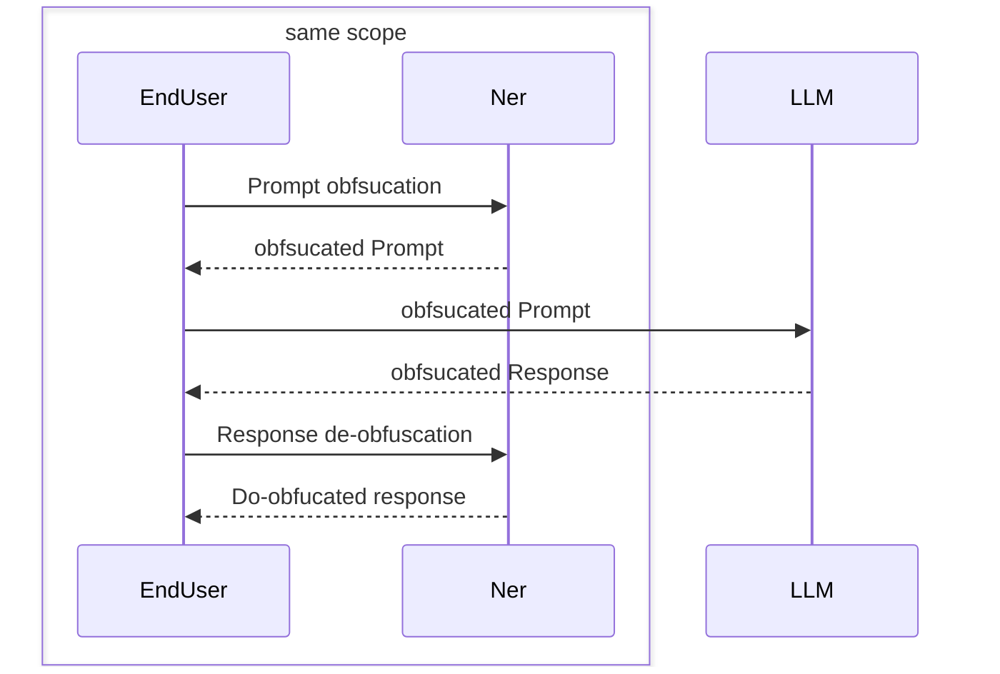
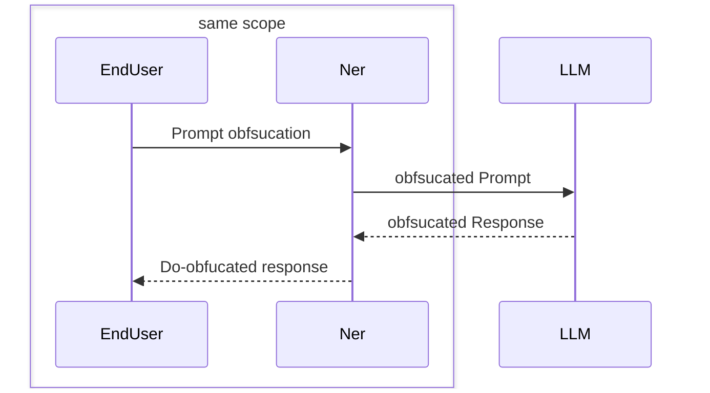

## Sujet

> Travaillant récemment sur des projets manipulant des données sensibles, nous avons exploré des approches légères et
> sobres en ressources pour faire de l’IA localement, sur le poste utilisateur.
>
> Dans cette session, nous verrons que l’utilisation d’un grand modèle de langage n’est pas obligatoire pour de tâches
> comme extraire des entités, structurer de l’information, classer des documents ou répondre à des questions simples.
> 
> Nous illustrerons :
> – comment des modèles comme BERT ou ses dérivés peuvent être exploités efficacement,
> – pourquoi ils sont souvent suffisants (voire préférables) dans des contextes réglementés ou avec peu de données,
> – un exemple atypique de classification de texte par compression (gzip + k-NN), sans aucun réseau de neurones, et
> comment distribuer des modèles ONNX et les faire tourner avec un runtime Rust ultra-performant (et multiplateforme),
> – le mécanisme de distribution via un système d’agents locaux, autonomes et légers, qui s’exécutent directement sur
> les postes clients, sans dépendre d’un serveur central ou du cloud.
>
> Nous aurons également un regard équilibré sur les limites de ces approches : nous présenterons une analyse objective
> des cas où les LLM ou SLM modernes s’avèrent plus efficaces, notamment pour la désambiguïsation, le « raisonnement »
> ou la manipulation de contextes complexes.

## Etat des lieux [5 minutes]

Utilisation de LLM style ChpaGPT etc. mais avec possiblement des données sensibles:
- Avocat
- Medical
- etc.

Définition de "données sensibles" selon la CNIL:
> Ce sont des informations qui révèlent la prétendue origine raciale ou ethnique, les opinions politiques,
> les convictions religieuses ou philosophiques ou l'appartenance syndicale, ainsi que le traitement des données
> génétiques, des données biométriques aux fins d'identifier une personne physique de manière unique, des données
> concernant la santé ou des données concernant la vie sexuelle ou l'orientation sexuelle d'une personne physique."

## Comment y répondre: LLM vs SLM [15 minutes]

Limitation de l'usage exclusif d'un LLM et exploitation de SLM pour repondre à la problèmatique

### Comparaison pro/cons [5 minutes]

Comment un peut modèle de langage peut couvrir un besoin spécifique tout en nécessitant de la mémoire et du CPU 
raisonnablement ? 

### Illustration avec BERT [10 minutes]

Faire une première explication avec le modèle BERT avec un principe de classification ...

## Impactes d'un point de vu architecture [10 minutes]

Un telle séparation permet d'avoir une approche adaptative. Cela permet d'avoir plusieurs étages à savoir un pour 
la gestion des données sensible et un un pour le traitement du prompt en soit.

### Cas 1: En tant que service

### Cas 2: Dans le flux

### Défis concernant la tracabilité, l'administration [5 minutes]

Comment gerer le modèle, son exploitation et la personnalisation.

## Retour d'expérience [10 minutes]

TODO

## Perspectives

### Quid de MCP [5 minutes]

Elaborer le discours autour des risques supplémentaires:
- gestion des données sensibles
- confiance dans la connectivité
- identification pour authorisation
- qualification de code avant execution

## Conclusion

TODO

